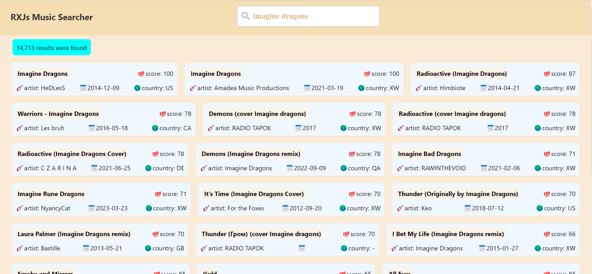

# RXMusic
### RXMusic is a song search app
A simple app to practice reactive programming using RXJS.
I used RXJS to debounce & filter inputs, handle network requests & pagination. also wrote some tests to get familiar with testing libraries like jest.

[Live Demo](https://rxjs-music.netlify.app/)

### Here's how it looks:

